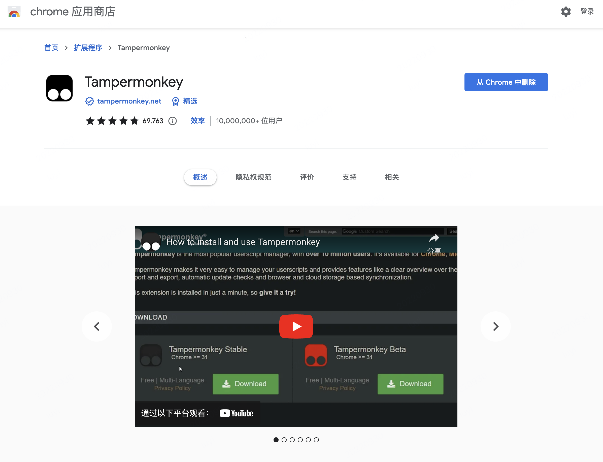

# iPhoneOrder
此项目为苹果iPhone自动抢购的油猴脚本， 支持Chrome和Edge浏览器
<br/>
自动刷新，无需值守，仅需将所要抢购的iPhone放入购物车，点击购物车即可
<br/>
当前仅支持一次抢购一部iPhone
<br />

### <p style='color:red'><b>此项目仅用于学习交流！！！</b></p>
<br />

## 使用说明
### 下载及安装插件
1. 从应用商店下载Tampermonkey插件




2. 管理扩展程序，允许Tampermonkey读取本地文件


3. 下载此项目的release文件 [iPhoneOrder.js](http://git.dev.sh.ctripcorp.com/luyia/iphoneorder/-/releases "iPhoneOrder.js") 到本地

4. 新建一个名为 iPhoneOrder 的脚本

5. 点击该脚本，设置，添加跨域白名单


<br />
### 脚本内容
将以下内容复制进脚本

<b>注意：最后一个 @require 需改为前面第3步下载的iPhoneOrder.js文件的本地路径</b>
<br/>
<b>注意：配置信息请按说明填入</b>

```javascript
// ==UserScript==
// @name         iPhoneOrder
// @namespace    http://tampermonkey.net/
// @version      0.1
// @description  try to take over the world!
// @author       You
// @match        https://*.www.apple.com.cn/shop/checkout
// @match        https://*.www.apple.com.cn/shop/checkout?*
// @match        https://*.www.apple.com.cn/shop/checkout/start*
// @match        https://www.apple.com.cn/shop/sorry/session_expired
// @match        https://www.apple.com.cn/shop/sorry/message_generic
// @match        https://www.apple.com.cn/shop/bag
// @match        https://*.www.apple.com.cn/shop/signIn?*
// @exclude      https://*.www.apple.com.cn/shop/checkout/status
// @exclude      https://*.www.apple.com.cn/shop/checkout/interstitial
// @icon         https://www.google.com/s2/favicons?sz=64&domain=apple.com.cn
// @require      file://{脚本下载后在本地的路径}
// @grant        GM_xmlhttpRequest
// ==/UserScript==

let iPhoneOrderConfig = {
    // ********** 以下必填 **********
    lastName: '', // 姓
    firstName: '', // 名
    mobile: '', // 手机号
    last4code: '', // 证件号后四位
    appleId: '', // apple账号 需填写邮箱 
    // ********** 以上必填 **********

    // ********** 以下可选 **********
    password: '', // apple密码 可不填，不填则以访客模式下单
    stepWait: 10, // 步频等待秒数 默认10秒， 可不填，不建议设置过短，会封IP
    payBill: 'alipay', // 付款方式，支持以下几类 [alipay/wechat/ccb/cmb/icbc/huabei] 可不填，默认支付宝
    payInstallment: 0, // 分期笔数 可不填 支持 0，3，6，12，24； 花呗不支持24期，支付宝/微信不分期
    provinceName: '上海', // 省份名，不填则默认上海
    cityName: '上海', // 城市名，不填则默认上海
    districtName: '闵行区', // 城市内区名，不填则默认闵行区
    employeeId: '' // 员工号，用于内网推送抢购成功消息
    // ********** 以上可选 **********
}

window.iPhoneOrder(iPhoneOrderConfig)
```
<br>

### 操作步骤
1. 打开[苹果官网](https://www.apple.com.cn)，选择心仪的iPhone，并放入购物车

2. 打开[购物车](https://www.apple.com.cn/shop/bag)页面，脚本便开始自动抢购，无需值守，抢购成功后，前面填入的手机和邮箱都会收到消息。
