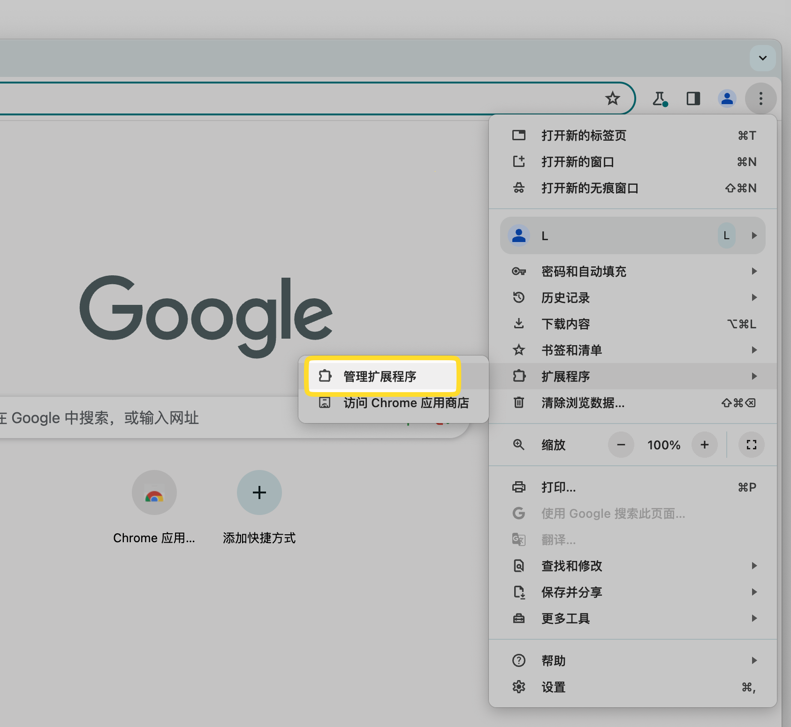
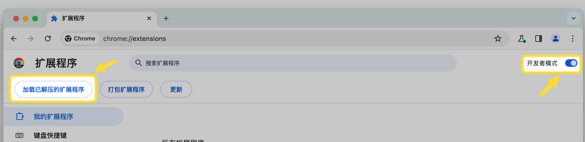
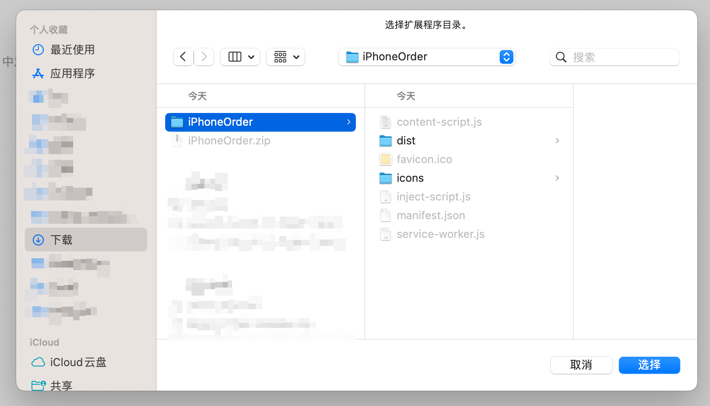
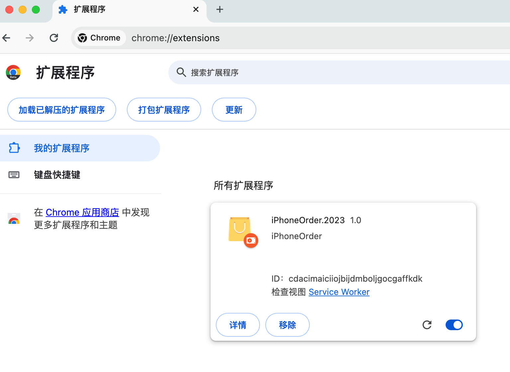
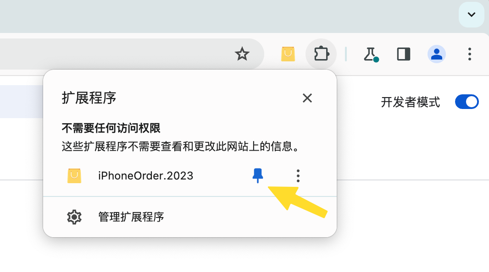
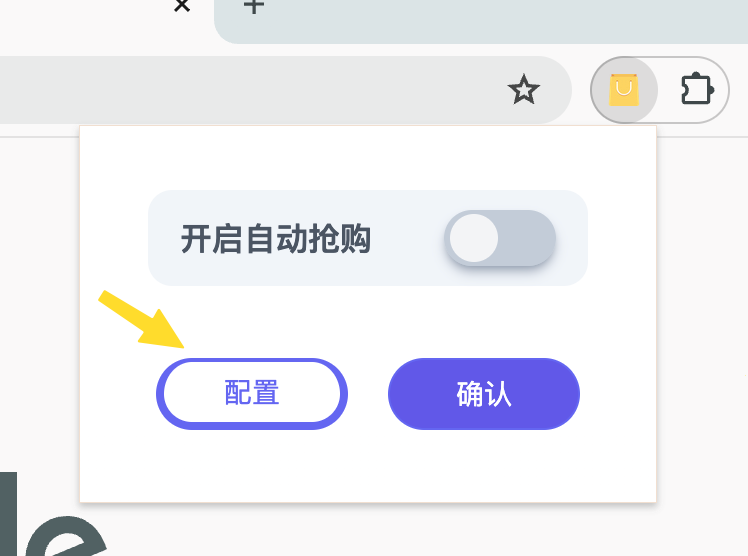
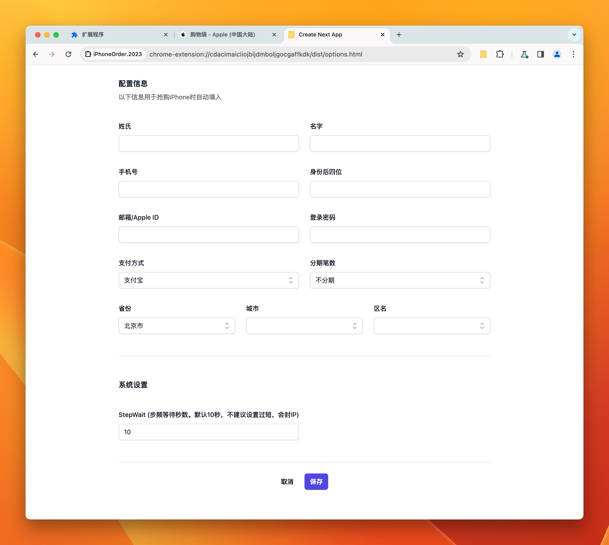
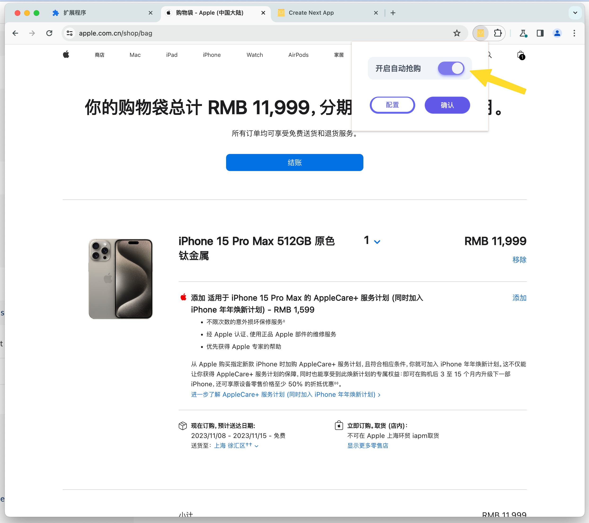

## iPhoneOrder.2023

<b>2023版 iPhone 自动抢购插件</b>

苹果官网本身并未限制 iPhone 下单，但选择配送可能交付时间过长。该插件用于自动捡漏可门店自提的订单。

<b>********** 该插件仅用于学习和交流 **********</b>

<b>请注意: 本项目采用 [Bun](https://github.com/oven-sh/bun) 进行打包和启动, 与npm略有不同。</b>

------

### 更新日志以及遗留问题

#### 2023.09.17 更新二
遗留问题
1. 由于插件中的 省份/城市/地区 数据并非来自苹果的店铺页面，可能产生配置中的区域和页面对不上，导致始终无法获取到最新的取货店铺。也可自己修改 shared/location 目录中的信息，重新编译打包使用。

 

更新内容

>v0.5 版本已走通 iPhone 15 新款的流程。
>
>新款和老款在取货上的区别是，新款会增加到店取货时间，以及在选择时间时会校验签名，此流程已走通。
>
>目前 v0.5 在选择自提店铺页面时，后台会不断请求配置中填写的区域店铺，页面上展示的地址可能与配置中的地址不同，这个不影响最后下单时的取货店铺。
>
>当后台匹配到与配置中填写城市相符的店铺有货时，会自动下单，取货店铺页会一步到达付款页。
>
>如果自己手快点击下一步，也会自动填写信息下单。

 

#### 2023.09.17 更新

1. ~~苹果调整了取货店铺信息的接口，插件需要调整；~~ (已修复)
2. ~~注入 history.pushState 的方式目前未生效，导致页面跳转之后没有继续执行。~~(已修复)

 

------

### 安装和使用
1. 点击下载安装 [Release](https://github.com/loo-y/iPhoneOrder.2023/releases/)

2. 解压缩到本地任意目录

3. 打开Chrome 或者 Edge 浏览器

4. 找到管理扩展程序
    

5. 开启开发者模式， 点击 "加载已解压缩的程序" 
    

6. 选中刚才解压缩的 iPhoneOrder 文件夹
    

7. 安装成功之后可以在扩展程序中看到已应用
    

8. 点击左上角扩展程序标志，找到 iPhoneOrder 并固定
    

9. iPhoneOrder将被固定在右上角，点击打开，选择配置
    

10. 填写必要的配置信息
    

11. 打开 苹果官网，将想要的 iPhone 预先放入购物车，点击开启，并确认
    

 

------

### 注意
插件将会自动刷新抢购，请保持电脑不要自动休眠。

同一个浏览器的配置是共享的，所以一个浏览器只能抢购一部，如果需要同时抢购，可以开启多个 Chrome 个人配置，分别安装。

需要注意的是，同一个 IP 访问次数过多，会导致暂时性的无法访问或者拒绝访问。

